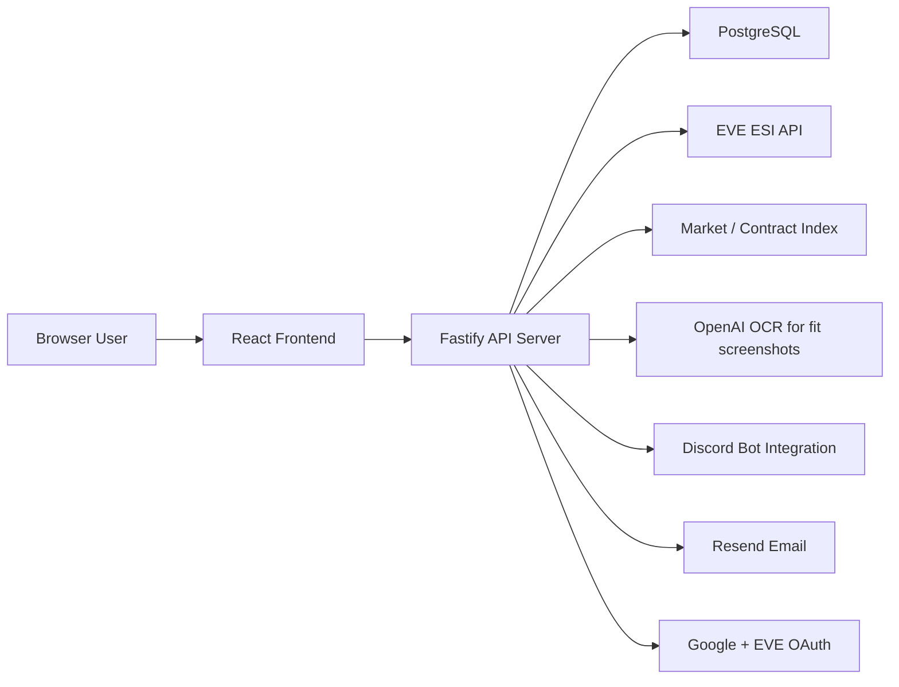
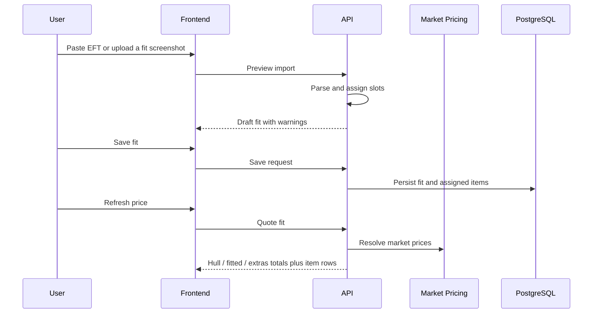

# High-Level and Low-Level Design

Project: LoW Manager / Outfit420
Version: 0.2 draft
Date: 2026-09-01
Status: Informal technical design artifact

## 1. High-Level Design

LoW Manager is a multi-user EVE Online operations dashboard. It combines authenticated pilot data from ESI with global public data such as market metadata, ship/item reference data, public fits, and doctrines.

The system is split into four primary layers:

1. Browser frontend
2. Node/Fastify application server
3. PostgreSQL persistence layer
4. External integrations

## 2. Architecture Overview

## 3. Core Modules

| Module | Responsibility |
| --- | --- |
| Auth | User signup, login, sessions, Google and EVE account OAuth, password reset |
| Characters | EVE SSO pilots, token refresh, main pilot selection |
| Fits | EFT parsing, Pyfa and in-game screenshot import, saved/public/private fits |
| Doctrines | Collections of saved fits, descriptions, public/private visibility |
| Market | Shopping lists, item price lookup, fit cost totals |
| Contracts | Region contract index, ship contract search, jump distance |
| Assets | Pilot asset snapshots, rollups, value summaries |
| Discord Import | Channel/thread listing and fit candidate extraction |
| Static/Public | Legal pages, public fit/doctrine routes, app shell |

## 4. Data Visibility Model

| Data Type | Scope |
| --- | --- |
| EVE pilot tokens | Private to owning user |
| Pilot assets, skills, PI, industry state | Private to owning user |
| Public EVE reference data | Global |
| Public fits | Global read, owner/admin edit |
| Private fits | Owner only |
| Public doctrines | Global read, owner/admin edit |
| Private doctrines | Owner only |
| Audit/security events | Anonymized retention |

## 5. External Integrations

- EVE ESI: Account login, pilot authorization, assets, skills, contracts, and in-game fit export.
- Google OAuth: User login.
- Resend: Account verification and password reset email.
- OpenAI API: Pyfa and in-game fitting screenshot extraction to EFT-style import text.
- Discord API: Bot-based channel scanning for EFT text and fit screenshots.
- Railway: Production hosting and PostgreSQL.

## 6. Low-Level Design

### 6.1 Frontend

Technology:

- React
- TypeScript
- Vite
- CSS modules through shared stylesheet conventions

Primary views:

- `/pilots`
- `/fleet`
- `/fits`
- `/fit/:id`
- `/doctrine/:id`
- `/assets`
- `/market`
- `/contracts`
- `/industry`
- `/planets`

Frontend responsibilities:

- Maintain selected view and route state.
- Render private and public views based on authenticated user state.
- Provide import modals for EFT, Pyfa or in-game fitting screenshots, and Discord.
- Render fit layouts using EVE item icons and assigned slot sections.
- Trigger pricing, refresh, save, publish, copy, and send actions.

### 6.2 Backend API

Technology:

- Node.js
- Fastify
- TypeScript

API responsibilities:

- Authenticate requests and enforce user scoping.
- Handle EVE OAuth state and token refresh.
- Persist user accounts, sessions, pilot tokens, fits, doctrines, and asset snapshots.
- Serve public read-only fit and doctrine data without authentication.
- Perform fit parsing, pricing, and ESI payload generation.
- Run contract indexing and asset refresh workflows.

### 6.3 Database

Technology:

- PostgreSQL

Key entities:

- users
- sessions
- app_auth_tokens
- characters
- saved_fits
- saved_fit_items
- doctrines
- doctrine_fits
- asset_snapshots
- universe_cache
- contract_index tables

Design notes:

- Private rows carry an owner/user reference.
- Public library rows retain original owner where relevant.
- Deleting a user removes private pilot-derived data and private library data.
- Public fits/doctrines can be retained under admin ownership.

### 6.4 Fit Import and Pricing Flow

### 6.5 Doctrine Flow

- User creates a doctrine manually.
- User adds existing saved fits.
- Doctrine can be private or public.
- Public doctrines can only contain visible public member fits.
- Non-owners can copy a public doctrine into a private library.

### 6.6 Deployment

Runtime:

- Railway application service
- Railway PostgreSQL service

Deployment behavior:

- Build command generates EVE mastery/reference data and builds the app.
- Predeploy command runs database migrations.
- Start command launches the Node server.
- Health check uses `/api/health`.

## 7. Operational Notes

- Environment variables configure OAuth clients, EVE developer credentials, cookie secrets, encryption keys, email provider, OpenAI API key, Discord bot token, and database URL.
- The app should fail clearly when optional integrations are not configured.
- Public routes must continue to work even when the viewer is unauthenticated.

## 8. Future Design Items

- Rebuild Google Docs doctrine import as a standalone integration.
- Add deeper fit analytics and doctrine comparison.
- Improve asset location resolution and station/structure caching.
- Add admin moderation workflows for public content.
